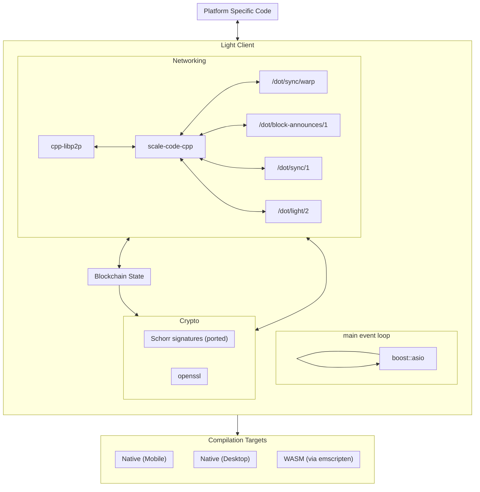

# Implementation

## Boost

Implementation will use a single `boost::asio`-loop based approach without extra threads. The reasons why we choose `boost::asio` for a run loop and I/O:
 - `boost::asio` is already used in the [libp2p library](https://github.com/libp2p/cpp-libp2p) we are going to use for p2p communication (see below). Having several I/O libraries and loops being used in one application would introduce extra complexity, the need of synchronization and is a potential source of errors.
 - `boost::asio` supports all the functionality we need apart from p2p: timers, posting and dispatching tasks, synchronization and execution ordering, building a JSON RPC server on top of it.
 - having a single `boost::asio::io_service`-loop that processes all the requests removes the need of having concurrent access synchronization (while logical synchronization still may be required), makes the code WebAssembly-friendly and introduces well-defined asynchronous logic.

 While `boost::asio` is mostly callback based (and so `cpp-libp2p` is) we are planning to wrap callbacks in C++ 20 coroutines, so that async code will have a more Rust-like look. That would significantly improve code readability (logic isn't split between multiple nested callback functions), however may require more skilful contributors since C++ coroutines are still quite new to a lot of C++ developers. Every incoming RPC request will end up with a coroutine creation object that will wait for I/O data in its suspension points. Also some coroutines will handle background tasks, e.g. connection management, notifications processing etc.

## Emscripten
All platform-specific code will be abstracted out. That would allow us to compile the same C++ code both to native binaries and to a WASM module.

Emscripten will be used to compile C++ code into WASM module.

## Binaryen

We will use [binaryen](https://github.com/WebAssembly/binaryen) to run WebAssembly inside _the client_. Binaryen is a compiler and toolchain infrastructure library for WebAssembly written in C++. Reasons behind this choice:
- binaryen is cross-platform and supports compilation to WebAssembly itself,
- it has the ability to compile and interpret WebAssembly. Light client may not execute methods on a single runtime often, therefore interpreting option may be faster for a single method call,
- it is fast and effective, it is optimized to use all available CPU cores, it also compiles to WebAssembly quickly,
- it contains many optimizations that improve code size and speed,
- binaryen is already used by other projects (e.g. Emscripten, Kagome) so it is a tested solution.

## Dependencies

- We will use [cppcoro](https://github.com/lewissbaker/cppcoro) library for working with coroutines. C++ standard library doesn't provide existing primitives (awaitable types, synchronization, etc) for coroutines. `cppcoro` is one the most mature C++ coroutine libraries for now.

- [scale-code-cpp](https://github.com/soramitsu/scale-codec-cpp) will be used for SCALE encoding/decoding.

- [cpp-libp2p](https://github.com/libp2p/cpp-libp2p) will be used as libp2p implementation. We will extend these libraries to support building with the Conan package manager. Also we will add support of building with Emscripten and websocket clients.

## Light Client Component Interactions

The client will perform light-weight interactions with components (e.g., GRANDPA) by way of two groups of messaging:
- notification messages
- request/response messages

Notifications make use of the following protocols:
- /dot/block-announces/1
- /dot/transactions/1
- /paritytech/grandpa/1

Block announces are intentionally sent only to light clients, and not to full nodes. Block announces coming from light clients are useless to full nodes, as they can't download the block body (which they need) from that light client.

Request/Responses use these protocols:
- /dot/sync/2
- /dot/light/2
- /dot/kad
- /dot/sync/warp

The `/dot/state/2` protocol is only supported by full nodes

More research is required to determine exactly what ...

## Protocol Support

To support the light client functionality we will implement the support of the following protocols:

- /dot/sync/warp
- /dot/block-announces/1
- /dot/sync/1
- /dot/light/2

## JSON-RPC methods

The following methods will be implemented: `rpc_methods`, `chainHead_unstable_follow`, `chainHead_unstable_unfollow`, `chainHead_unstable_unpin`, `chainHead_unstable_storage`, `chainHead_unstable_call` and `chainHead_unstable_stopCall`. All of `chainHead` methods allow tracking of the chain and their storage. The most important ones that will be implemented at the first stage are:
- `chainHead_unstable_follow` which is the first method that should be called by the client. It returns the current list of blocks that are near the head of the chain and generates notifications about new blocks. 
- `chainHead_unstable_unpin` method which should be called whenever a `{"event": "finalized"}` notification is received by a subscriber
- `chainHead_unstable_unfollow` - stops a subscription started with `chainHead_unstable_follow`

The remaining methods will allow the client to get more information about blocks in the chain.

## Storage

We will use a hash map to store the blockchain state.  This is an in-memory serialization/deserialization data structure, consisting of the current peers and block header information for some number of blocks (i.e., a history). This object functions as a *de facto* database.

As local storage in a browser is severely limited (5-10 MB), we cannot have persistence of a database. [Smoldot](https://github.com/paritytech/smoldot) uses the same method.  Although we are not aware of any issues that smoldot has with non-persistence, this aspect will be thoroughly tested.

## Crypto Libraries

We will use openssl for cryptographic functions.  Openssl supports Blake2, a highly optimized SHA-3 algorithm, which we plan on using.  As for the algorithms missing from openssl, they will be ported (e.g. Schnorr signatures).

There do exist alternatives to openssl, but they are not as complete; going in that direction would increase the number of third-party dependencies.  Boost already uses openssl for its networking (TLS connections), and cpp-libp2p links in both libcrypto and libssl.

The library is highly tested and optimized.  Since we will be linking with static libraries, the space requirements will remain minimal.

As the project develops we will periodically profile the cryptographic code, and may make changes if necessary.
