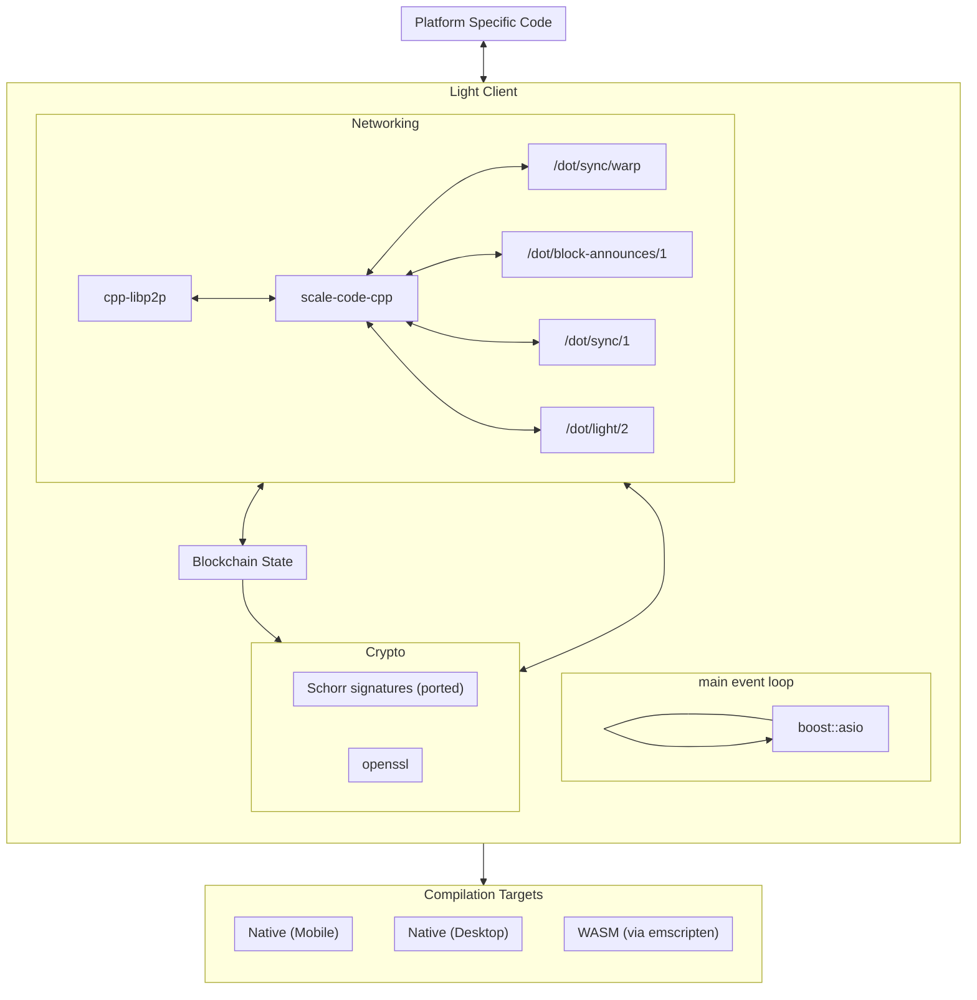

# Implementation

## Boost

Implementation will use a single `boost::asio`-loop based approach without extra threads. The reasons why we choose `boost::asio` for a run loop and I/O:
 - `boost::asio` is already used in the [libp2p library](https://github.com/libp2p/cpp-libp2p) we are going to use for p2p communication (see below). Having several I/O libraries and loops being used in one application would introduce extra complexity, the need of synchronization and is a potential source of errors.
 - `boost::asio` supports all the functionality we need apart from p2p: timers, posting and dispatching tasks, synchronization and execution ordering, building a JSON RPC server on top of it.
 - having a single `boost::asio::io_service`-loop that processes all the requests removes the need of having concurrent access synchronization (while logical synchronization still may be required), makes the code WebAssembly-friendly and introduces well-defined asynchronous logic.

 While `boost::asio` is mostly callback based (and so `cpp-libp2p` is) we are planning to wrap callbacks in C++ 20 coroutines, so that async code will have a more Rust-like look. That would significantly improve code readability (logic isn't split between multiple nested callback functions), however may require more skilful contributors since C++ coroutines are still quite new to a lot of C++ developers. Every incoming RPC request will end up with a coroutine creation object that will wait for I/O data in its suspension points. Also some coroutines will handle background tasks, e.g. connection management, notifications processing etc.

## Emscripten
All platform-specific code will be abstracted out. That would allow us to compile the same C++ code both to native binaries and to a WASM module.

Emscripten will be used to compile C++ code into WASM module.

## Dependencies

- We will use [cppcoro](https://github.com/lewissbaker/cppcoro) library for working with coroutines. C++ standard library doesn't provide existing primitives (awaitable types, synchronization, etc) for coroutines. `cppcoro` is one the most mature C++ coroutine libraries for now.

- [scale-code-cpp](https://github.com/soramitsu/scale-codec-cpp) will be used for SCALE encoding/decoding.

- [cpp-libp2p](https://github.com/libp2p/cpp-libp2p) will be used as libp2p implementation. We will extend these libraries to support building with the Conan package manager. Also we will add support of building with Emscripten and websocket clients.

## Protocol Support

To support the light client functionality we will implement the support of the following protocols:

- /dot/sync/warp
- /dot/block-announces/1
- /dot/sync/1
- /dot/light/2

## Database

We will use a hash map to store the blockchain state.  This is an in-memory serialization/deserialization data structure, functioning as a de facto database.

As local storage in a browser is severely limited (5-10 MB), we cannot have persistence of a database. Smoldot uses the same method.  Although we not aware of any issues that smoldot has with non-persistence, this aspect will be thoroughly tested.

## Crypto Libraries

We will use openssl for cryptography functions (e.g. Blake2), and port the needed algorithms not included in openssl (e.g. Schnorr signatures).
