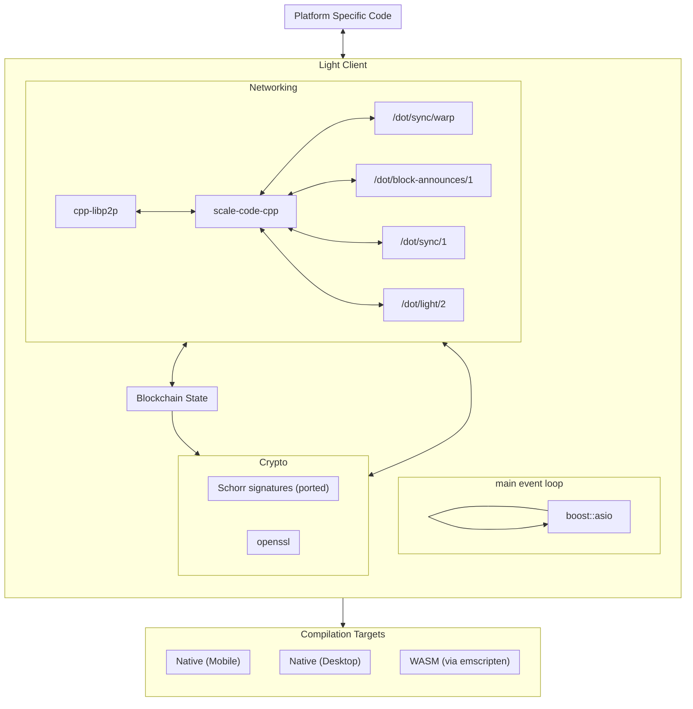

# Implementation

Implementation will use a single boost::asio-loop based approach without extra threads. All platform-specific code will be abstracted out. That would allow us to compile the same C++ code both to native 
binaries and to a WASM module.

We will use [binaryen](https://github.com/WebAssembly/binaryen) with Emscripten to create the WASM module. Binaryen is a compiler and toolchain infrastructure library for WebAssembly written in C++. 

[scale-code-cpp](https://github.com/soramitsu/scale-codec-cpp) will be used for SCALE encoding/decoding. 

[cpp-libp2p](https://github.com/libp2p/cpp-libp2p) will be used as libp2p implementation. We will extend these libraries to support building with the Conan package manager. Also we will add support of building with Emscripten and websocket clients.

To support the light client functionality we will implement the support of the following protocols:

- /dot/sync/warp
- /dot/block-announces/1
- /dot/sync/1
- /dot/light/2

We will use hash_map with serialization/deserialization to hold the blockchain state.

We will use openssl for cryptography functions (e.g. Blake2), and port the needed algorithms not included in openssl (e.g. Schnorr signatures).
